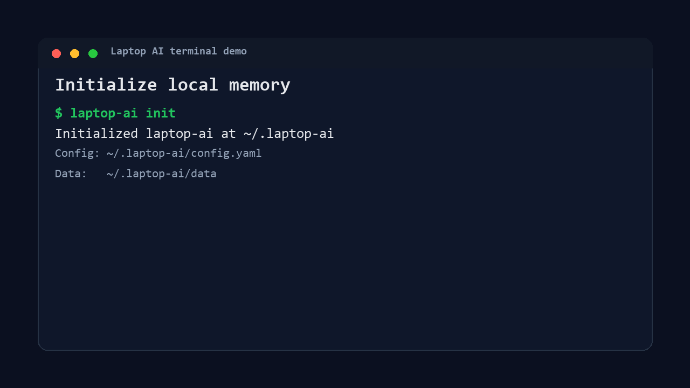

# Laptop AI

Private AI memory infrastructure for personal computers.

Laptop AI is a local-first AI memory engine that lets users ask questions about
files on their computer using local LLMs. It indexes selected folders into a
custom disk-backed vector database and retrieves relevant context for private,
source-cited answers.



## Setup

Requirements:

- Go 1.22+
- Ollama running locally at `http://localhost:11434`
- Ollama models: `nomic-embed-text` and `llama3`

```sh
ollama serve
ollama pull nomic-embed-text
ollama pull llama3

go build ./cmd/laptop-ai
```

Run the verified demo:

```sh
./laptop-ai init
./laptop-ai index ./examples/notes
./laptop-ai ask "what controls movement in my biology notes?"
```

Windows PowerShell:

```powershell
.\laptop-ai.exe init
.\laptop-ai.exe index .\examples\notes
.\laptop-ai.exe ask "what controls movement in my biology notes?"
```

Expected shape:

```text
Answer:
Your biology notes say that the basal ganglia helps control movement. The
direct pathway promotes movement, while the indirect pathway suppresses movement.

Sources:
1. examples/notes/biology.md
```

The exact wording may vary because the answer is generated by a local model.

## CLI Examples

```sh
laptop-ai init
laptop-ai index ~/Documents/notes
laptop-ai ask "what did I write about pricing?"
laptop-ai stats
```

Current commands are intentionally small: `init`, `index`, `ask`, and `stats`.

## Architecture


Core packages:

- `internal/cli`: command flow
- `internal/indexer`: folder scan and change detection
- `internal/chunker`: overlapping text chunks
- `internal/embeddings`: local Ollama embeddings
- `internal/vectordb`: WAL, memtable, segments, cosine search
- `internal/llm`: local answer generation and prompt guardrails
- `internal/security`: ignore rules, secret detection, local-only controls

## Security Model

Default posture: local-only and fail closed.

- Indexes only user-selected folders.
- Refuses whole-home indexing.
- Loads `.laptopaiignore`.
- Skips denylisted files such as `.env`, private keys, SSH folders, and
  dependency directories.
- Scans file contents for secret-looking values before indexing.
- Skips symlinks by default.
- Sends embeddings and prompts only to local Ollama in the wired CLI path.
- Stores audit metadata only: events and source paths, not question or chunk text.

## Threat Model

Laptop AI is designed to reduce these risks:

| Threat | Mitigation |
|---|---|
| Accidentally indexing secrets | denylist + content secret scanner |
| Indexing too much | explicit folder allowlist + whole-home refusal |
| Symlink escape | symlinks skipped by default |
| Prompt injection inside documents | context is labeled untrusted and cannot override system rules |
| Cloud leakage | CLI uses local Ollama; cloud send path is not wired |
| Crash during writes | WAL replay + atomic segment writes |

Out of scope today: malware on the machine, compromised Ollama server, and
encrypted-at-rest vector files.

## Benchmarks

Run:

```sh
go test ./internal/vectordb -run=^$ -bench=Benchmark -benchmem -count=1
```

Recent local Windows run:

| Operation | Result |
|---|---:|
| Insert | 92,224 ns/op |
| Search 1k records | 959,875 ns/op |
| Search 10k records | 7,775,945 ns/op |
| Search 100k records | 15,404,674 ns/op |
| Open 10k records | 32,024,443 ns/op |
| WAL replay 5k records | 23,830,869 ns/op |
| Flush 5k records | 39,853,439 ns/op |

Numbers vary by disk, CPU, and corpus shape.

## Limitations

- Requires a running local Ollama server.
- Local LLM answers can be slow on CPU-only machines.
- Re-indexing changed files appends new chunks; stale chunk cleanup is not built.
- Vector DB files are not encrypted yet.
- Segment indexes are full ID-to-offset maps, not true sparse/block indexes.
- No `search`, `sources`, `forget`, or `doctor` commands yet.
- Cloud-provider preview helpers exist, but cloud models are not wired into CLI.

## Future Work

- Encrypted vector storage.
- Sparse/block segment indexes.
- Stale chunk deletion and compaction.
- Optional Ollama integration tests.
- `search`, `sources`, `forget`, and `doctor` commands.
- Recorded terminal demo from a clean clone.
